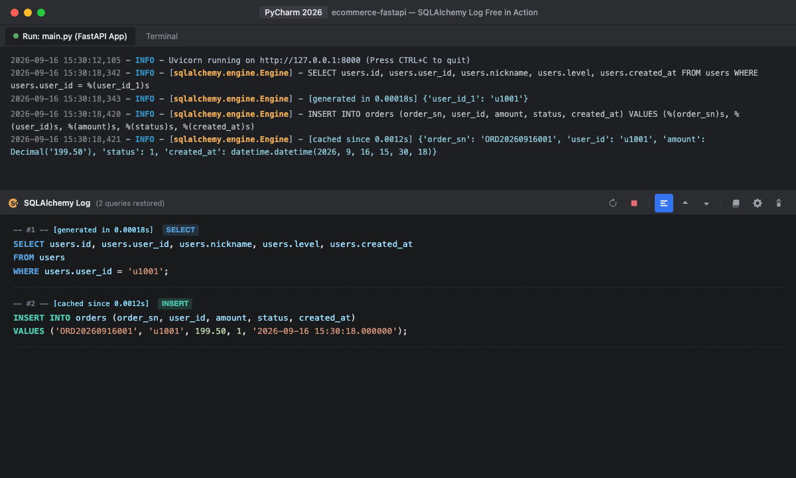
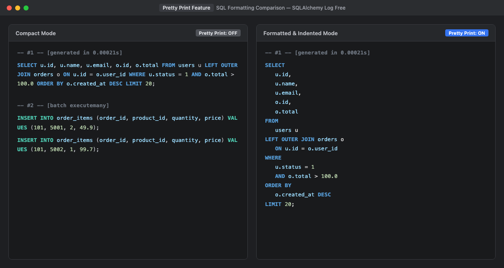

# SQLAlchemy Log Free (PyCharm / IntelliJ 插件)

[English](README.md) | [中文说明](README_CN.md)

**SQLAlchemy Log Free** 是一款专为 **PyCharm** 及 IntelliJ Platform 系列 IDE 设计的免费开源插件。它可以实时拦截控制台输出的 SQLAlchemy SQL 日志，自动提取参数并将占位符替换还原为完整、可直接执行的 SQL 语句，并在专用的 Tool Window 窗口中高亮输出。

参考并致敬了广泛使用的开源插件 [`starxg/mybatis-log-plugin-free`](https://github.com/starxg/mybatis-log-plugin-free)。

---

## 功能特性

- **实时拦截还原**：实时捕获 Python 运行/调试控制台（Run、Debug、PyTest、FastAPI、Flask、Django、Celery 等）中的 SQLAlchemy engine 输出。
- **全参数占位符兼容**：
  - `?`（qmark 风格 - SQLite、ODBC 等）
  - `%s`（format 风格 - MySQL、psycopg2 等）
  - `%(name)s`（pyformat 风格 - PostgreSQL、pymysql 等）
  - `:name`（named 命名参数 - Oracle、原生文本 SQL，并智能避开 PostgreSQL `::type` 类型转换语法）
  - `$1, $2, ...`（numeric 风格 - asyncpg 等）
- **丰富 Python 类型转换**：
  - `None` &rarr; `NULL`
  - `True` / `False` &rarr; `1` / `0`
  - `datetime.datetime(...)` &rarr; `'YYYY-MM-DD HH:MM:SS.ffffff'`
  - `datetime.date(...)` &rarr; `'YYYY-MM-DD'`
  - `datetime.time(...)` &rarr; `'HH:MM:SS'`
  - `Decimal(...)` &rarr; `99.95`
  - `UUID(...)` &rarr; `'...'`
  - 字符串单双引号及转义处理（`'It''s ok'`）
  - 二进制字节流（`b'...'`）
- **批量操作支持（Executemany）**：自动将批量插入或更新（如 `[('A', 1), ('B', 2)]`）展开为多条完整的可执行 SQL。
- **事务与 DDL 监控**：清晰捕获并高亮 `BEGIN`、`COMMIT`、`ROLLBACK`、`SAVEPOINT` 等事务生命周期。
- **独立 Tool Window 工具窗口**：
  - 专属 `SQLAlchemy Log` 面板。
  - 语句计数器与执行耗时显示（如 `[generated in 0.00018s]`）。
  - 按 SQL 类型区分高亮颜色（**SELECT**、**INSERT**、**UPDATE**、**DELETE**、**TRANSACTION**）。
- **常用工具栏操作**：
  - **重新运行/启动（Rerun/Start）**：一键开启或重启日志拦截。
  - **暂停（Stop）**：暂停日志拦截。
  - **配置（Settings）**：支持自定义日志前缀、参数特征、忽略关键字及各类型 SQL 颜色。
  - **上一条/下一条 SQL（Previous / Next）**：在控制台中快速上下跳转 SQL 语句。
  - **SQL 格式化（Pretty Print）**：一键开启/关闭 SQL 换行与美化缩进。
  - **复制 SQL（Copy SQL）**：一键复制选中区域或完整 SQL。
  - **清空（Clear All）**：快速清空控制台日志。

---

## 插件截图

### 1. 实时拦截控制台与还原执行效果


### 2. SQL 格式化美化对比（Pretty Print 开关）


### 3. 自定义配置与高亮颜色设置


---

## 安装方式

### 方式 1：本地 Zip 包离线安装
1. 下载或编译生成的插件压缩包：`build/distributions/SQLAlchemy-Log-Plugin-Free-1.0.0.zip`。
2. 打开 PyCharm / IntelliJ：
   - 进入 **Settings**（`Cmd + ,` 或 `Ctrl + Alt + S`） &rarr; **Plugins**。
   - 点击齿轮图标 :gear: &rarr; **Install Plugin from Disk...**。
   - 选择 `SQLAlchemy-Log-Plugin-Free-1.0.0.zip` 文件。
   - 点击 **Restart IDE** 重启生效。

### 方式 2：源码编译
```bash
# 进入项目目录
cd SQLAlchemy-Log-Plugin-Free

# 执行打包任务（已内置 Gradle Wrapper）
./gradlew buildPlugin

# 生成的安装包位于：
# build/distributions/SQLAlchemy-Log-Plugin-Free-1.0.0.zip
```

---

## 使用说明

### 1. 开启 SQLAlchemy 日志
确保 Python 应用中开启了 SQLAlchemy engine 日志输出。例如：

```python
import logging
from sqlalchemy import create_engine

# 方式一：引擎自带 echo
engine = create_engine("sqlite:///example.db", echo=True)

# 方式二：标准 logging 日志配置
logging.basicConfig()
logging.getLogger("sqlalchemy.engine").setLevel(logging.INFO)
```

### 2. 打开插件窗口
- 顶部菜单：**Tools** &rarr; **SQLAlchemy Log**。
- 或在任意运行控制台右键菜单中选择 **SQLAlchemy Log**。

### 3. 运行程序
正常运行或调试你的 Python 代码。控制台打印的日志会自动被捕获并还原：

```text
[程序控制台原始输出]:
INFO:sqlalchemy.engine.Engine:SELECT users.id, users.name, users.age FROM users WHERE users.name = ? AND users.age > ?
INFO:sqlalchemy.engine.Engine:[generated in 0.00018s] ('Alice', 18)

[SQLAlchemy Log 插件面板]:
-- #1 -- [generated in 0.00018s]
SELECT users.id, users.name, users.age 
FROM users 
WHERE users.name = 'Alice' AND users.age > 18;
```

---

## 设置与个性化配置

在工具栏左侧点击 **Settings** (:gear:) 按钮：
- **Engine Log Prefix**：日志引擎前缀（默认 `sqlalchemy.engine`）。
- **Parameter Indicator**：参数起始标记（默认 `[`，自动匹配 `[generated in ...]`、`[cached since ...]`、`[raw sql]` 等）。
- **Ignore Keywords**：过滤杂音 SQL（如 `PRAGMA`、`table_info` 等，一行一个）。
- **SQL Colors**：自由定义各类 SQL（SELECT、INSERT、UPDATE、DELETE、事务语句）的显示颜色。

---

## 开源协议

本项目基于 [Apache License 2.0](LICENSE) 协议开源。
